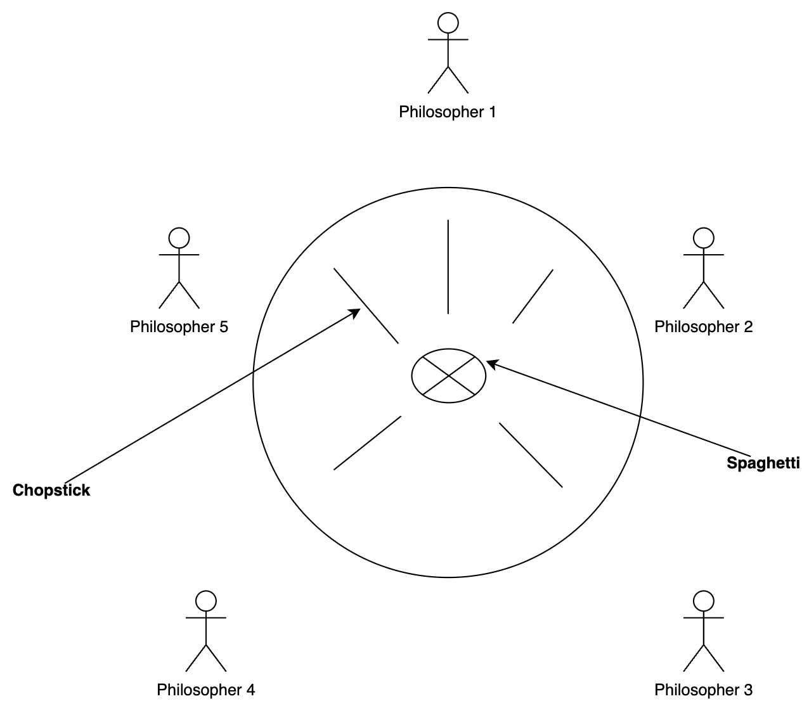

[Advanced and Robot Programming](https://corsi.unige.it/en/off.f/2022/ins/60228?codcla=10635)<br>
**Programmer:** [Ankur Kohli](https://github.com/ankurkohli007)<br>
[M.Sc Robotics Engineering](https://corsi.unige.it/corsi/10635)<br>
[University of Genoa (UniGe)](https://unige.it/en)<br>
**Supervisor:** [Prof. Renato Ugo Raffaele Zaccaria](https://rubrica.unige.it/personale/VUFOXVhs) & [Prof. Simone Macciò](https://rubrica.unige.it/personale/UUNAWFho)

## Dining Philosopher Problem ##

 ■ Five philosophers are in a **thinking - eating** cycle.<br>
 ■ When a philosopher gets hungry, he sits down, picks up **his left** and then **his right** chopsticks, and eats.<br>
 ■ A philosopher can eat only if he has **both** chopsticks.<br>
 ■ After eating, he puts down both chopsticks and thinks.<br>
 ■ This cycle continues.<br>



The above figure shows the brief structure of the **Dining Philosopher Problem**.

## Assignment Requirements ##

* Solved the problem with 5 processes, one per philosopher. Each philosopher is endless cycling, with randomly variable period (random "eating" time).

* A further process stores, using shared memory, the 5 chopsticks.

* Each philosopher prints on the screen what is doing. The same is done for the chopsticks status.

* Show that the solution never gets deadlocked, by making the philosophers to pick up simultaneously the 5 chopsticks.

The basic structure of the working of **Dining Philosopher Problem** is shown below:

```c
semaphore c[5] = 1;
philosopher i;
while (1)
{
// thinking
c[i].wait; // waiting for left chopstick to pick
c[(i+1) % 5].wait(); // waiting for left chopstick to pick
// eating
c[(i+1) % 5].signal(); // released right chopstick
c[i].signal(); // released left chopstick
// finish eating
}
```
## Dining Philosophers: Deadlock! ##

■ If all five philosophers sit down and pick up their left chopsticks at the same time, this causes a circular waiting and the program deadlocks.

***How does deadlock occur in dining philosophers problem?***

Deadlock could occur if every philosopher holds a left chopstick and waits perpetually for a right chopstick (or vice versa). Originally used as a means of illustrating the problem of deadlock, this system reaches deadlock when there is a 'cycle of unwarranted requests'.

***How I avoided deadlock in my Dining Philosopher Problem***

**Strategy:** 

1. Every philosopher must request each of their (shared) chopsticks from a waiter, who may refuse the request at first in order to avoid a deadlock. 
2. For convenience, we assume that all philosophers request their left chopstick first, then their right chopstick.
3. The waiter always provides chopsticks upon request unless only one chopstick remains unused. In that case, the waiter honors the request only if a right chopstick is requested; requests for a left chopstick are deferred until another philosopher finishes eating.

Argument for correct deadlock avoidance: The last chopstick will only be assigned if the waiter is certain that at least one philosopher can finish eating (thereupon releasing chopsticks). Therefore, the "circular wait" required for deadlock can't occur.

No starvation; fairness (depending on your waiter); degree of concurrency

**Downside:** Scalability (the waiter could become a bottleneck if the number of processors is large).

## Installation & Running ##

Inside the .zip archive are contained one file, only one shell scripts in the sources.zip archive and the text file you are reading. In the sources archive you find 1 directory wich contain the .c file and also a .txt file with  informations about the process.

First of all to unzip the sources archive and install the program using the command:

```
source ./install.sh <pathname>
```

It will create a folder called <pathname> inside which are located the folders that were in sources.zip, there will also be a folder with the executables of each process.
  
After that run the program with the command:

```
./run.sh
```
  
Each of this process has a section in which a signal is sent to the watchdog timer to prove they're functioning.

